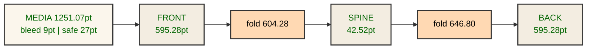

# SkillSynth Thesis — Print & Binding Specification

Technical reference for the 1-up jacket media (`thesis-print-spec.svg` · `thesis-jacket.svg`
`print-guides` layer). All lengths in print points (1/72 in); A4 trim per panel 210 × 297 mm.
Arabic (RTL) book: the media is laid out **front | spine | back** on one flat sheet, so the
spine bonds to the **right** edge of the front cover (front faces you, spine down the right edge,
open by lifting the left fore-edge).

## Boundary table

| Name | Value | Unit | Notes |
|------|-------|------|-------|
| bleed | 9 | pt | 3.17 mm, all four edges of every panel |
| trim (panel) | 210 × 297 | mm | per panel, 595.28 × 841.89 pt |
| safe | 27 | pt | 9.52 mm inside every trim |
| spine | 15 | mm | 42.52 pt, nominal; adjust to pages×0.11 (80gsm) + boards |
| folds / score lines | 604.28 / 646.80 | pt | the two spine score (fold) lines on the 1-up media |
| media (1-up jacket) | 1251.07 × 859.89 | pt | 441.68 × 303.41 mm, = 9 + 595.28 + 42.52 + 595.28 + 9 |
| booklet order | front | spine | back (RTL Arabic) | — | spine bonds to the RIGHT edge of the front cover |

## Print flow

- Flatten artwork and outline/all fonts before sending to press.
- Convert **RGB → CMYK at the print shop only** — never print the RGB PDF directly.
- Apply crop marks + the two spine score lines from `thesis-print-spec.svg` / `thesis-jacket.svg` `print-guides` layer.
- Set **3.17 mm bleed** (9 pt) on the finished job.
- The cover prints **double-sided**: side A = this outside jacket; side B = the blank inside/verso
  sheet (`thesis-inside.svg`, plain paper) with panel seams aligned to the same fold positions.

## Media cross-section

*(renders on GitHub)*

- **Bleed:** 9 pt (3.17 mm) each edge — content extends past the trim.
- **Safe:** 27 pt inside every trim — keep critical text inside.
- **Score / fold lines:** 604.28 and 646.80 pt on the 1-up media mark the two spine folds.
