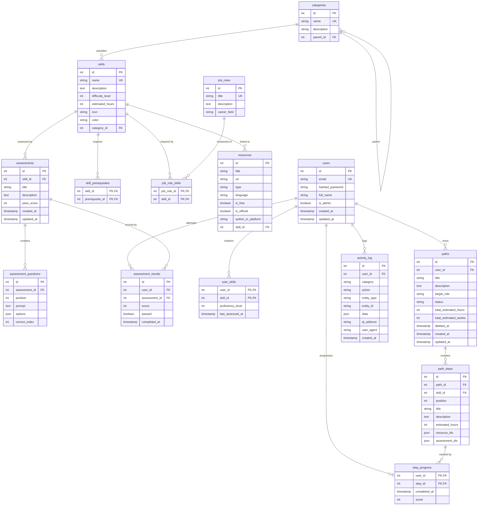

# SkillSynth Database ERD — 15 Tables (Strict 3NF)

## Table Inventory (15 total)

| # | Table | Domain | Cascade policy | Notes |
|---|-------|--------|----------------|-------|
| 1 | users | Identity | — | Absorbed profiles; is_admin binary admin flag |
| 2 | categories | Catalog | — | Self-ref parent_id (SET NULL) |
| 3 | skills | Catalog | — | category_id FK (SET NULL); absorbed skill_categories |
| 4 | skill_prerequisites | Catalog (J) | CASCADE | Self-referencing prerequisite DAG |
| 5 | job_roles | Catalog | — | Career role definitions |
| 6 | job_role_skills | Catalog (J) | CASCADE | M:N role→skill |
| 7 | resources | Catalog | SET NULL | skill_id FK optional |
| 8 | assessments | Assessment | SET NULL | skill_id FK; pass_score threshold |
| 9 | assessment_questions | Assessment | CASCADE | Normalized question bank; options JSON (documented exception) |
| 10 | assessment_results | Assessment | CASCADE | Attempt records |
| 11 | user_skills | Assessment | CASCADE | Composite PK (user,skill); real FKs |
| 12 | paths | Learning | CASCADE | Soft delete (deleted_at) |
| 13 | path_steps | Learning | CASCADE | skill_id FK (SET NULL); resource/assessment ids JSON |
| 14 | step_progress | Learning | CASCADE | Merged completions+progress; completed_at = done |
| 15 | activity_log | Engagement | SET NULL | Merged events+audit_logs; category ∈ {audit,auth,system,learning,realtime} |

(J) = Junction table. Cascade policy on FK: CASCADE = ON DELETE CASCADE, SET NULL = ON DELETE SET NULL.

## Notes

- Strict 3NF with 4 documented JSON exceptions: `assessment_questions.options`, `path_steps.resource_ids`, `path_steps.assessment_ids`, `activity_log.data`.
- Canonical DDL: `src/migrations/003_reduced_schema.sql`; verified against ORM by `tools/verify_schema.py` (SCHEMA MATCH — tables, columns, PKs, FKs incl. ON DELETE, uniques, indexes).
- Removal rationale + table→API coverage matrix: `docs/41-decision-records/adr-013.md`.
- Schema unchanged by SS-AI (ADR-015): AI wizard quizzes are ephemeral (SSE-only), practice tests persist in existing `assessments` rows titled `[AI] <Skill> — adaptive`, and proficiency reviews write `user_skills` + `activity_log` only.